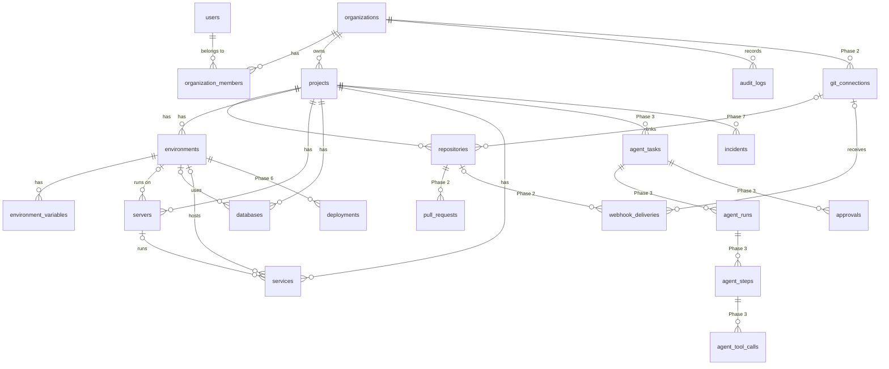

# Architecture

This document is the design baseline for the **AI Software Maintenance Platform**.
It covers the final target architecture (all phases) and marks clearly what is
implemented today. Phase status lives in [development.md](development.md#phases).

## 1. Final architecture

```text
                         USER (browser)
                              │
                              ▼
                    ┌───────────────────┐
                    │ Dashboard (React) │
                    └─────────┬─────────┘
                              │ REST + WebSocket
                              ▼
┌─────────────────────────────────────────────────────────────┐
│ CONTROL PLANE  (Laravel)                                    │
│  API gateway · Auth (Sanctum) · Tenancy · RBAC · Audit log  │
│  Projects · Environments · Secrets · Tasks · Approvals      │
│  Deployments · Incidents · Webhooks (GitHub / CI)           │
└───────────┬──────────────────────────────────┬──────────────┘
            │ Redis queues / streams (events)   │ PostgreSQL
            ▼                                   ▼
┌──────────────────────────────┐        (system of record)
│ AGENT ENGINE (FastAPI)       │
│  Orchestrator (state machine)│
│  Agents: Code/Debug/DB/      │
│          DevOps/Security/    │
│          Reviewer            │
│  LLMProvider abstraction     │
│  Memory + retrieval          │
└──────────────┬───────────────┘
               │ every tool call
               ▼
┌──────────────────────────────┐
│ TOOL GATEWAY                 │
│  permission → policy engine  │
│  → risk → approval → execute │
│  → audit                     │
└──────┬─────────┬─────────┬───┘
       ▼         ▼         ▼
    GitHub    Sandbox    Server/Docker connectors
              (Docker,   (allow-listed operations only,
              per task)   never arbitrary prod shell)
                 │
                 ▼
            CI/CD → Staging → AI review → Human approval → Production
                                                              │
                                                              ▼
                                                     Observability
                                                              │
                                              events ─────────┘──► Event bus ──► Agent
```

Key decisions:

| Decision | Choice | Why |
|---|---|---|
| System of record | Laravel + PostgreSQL | Tenancy, RBAC, approvals and audit belong in one transactional store. |
| AI runtime | Separate Python service | Python's AI/tooling ecosystem; the engine can be scaled and sandboxed apart from the control plane. |
| Agent ↔ control plane | Redis queue (tasks) + signed internal HTTP (callbacks) | Async, back-pressure friendly; the engine never touches the DB directly. |
| Who may execute tools | Only the Tool Gateway | A single choke point for policy, approval and audit. The LLM never gets raw credentials or shells. |
| Tenancy | Shared schema, `organization_id` on every tenant row + global scope + policies | Simple to operate; isolation is enforced in two independent layers. |
| Secrets | `SecretStore` contract (encrypted DB today; Vault/KMS later) | Secrets never leave the store in API responses or prompts. |

## 2. Technology stack

| Layer | Technology |
|---|---|
| Frontend | React 19, TypeScript, Vite, Tailwind CSS v4, React Router, TanStack Query |
| Control plane | Laravel 13 (PHP 8.4+), Sanctum token auth |
| Database | PostgreSQL 16 |
| Cache / queue / events | Redis 7 |
| Agent engine | Python 3.12, FastAPI, Pydantic (Phase 3+) |
| Sandbox | Docker (one ephemeral workspace per task, Phase 4) |
| Infra | Docker Compose (dev), GitHub Actions (CI) |

## 3. Repository structure

```text
.
├── frontend/          React dashboard
├── backend/           Laravel control plane
├── agent/             Python agent engine
│   └── app/{agents,orchestrator,tools,memory,policies,sandbox,services}
├── infrastructure/    deployment manifests (later phases)
├── docker/            Dockerfiles and entrypoints
├── docs/              this documentation
├── scripts/           helper scripts
├── .github/           CI workflows
├── docker-compose.yml
└── .env.example
```

## 4. Database ERD

Phase 1 tables are solid; later-phase tables are dashed in intent (designed, not yet migrated).
Full column reference: [database.md](database.md).



## 5. Service boundaries

| Service | Owns | Does **not** |
|---|---|---|
| **frontend** | UI state, presentation | Hold secrets; make authorization decisions |
| **backend** (Laravel) | Identity, tenancy, RBAC, projects/environments, secrets, tasks, approvals, deployments records, audit log, webhooks, realtime fan-out | Call LLMs; execute tools |
| **worker** (Laravel queue) | Async jobs: webhook processing, notifications, dispatching tasks to the agent | — |
| **agent** (FastAPI) | Orchestration, planning, LLM calls, memory/retrieval, tool gateway, sandbox lifecycle | Store tenant data of record; bypass policy |
| **sandbox-runner** (Phase 4) | Ephemeral Docker workspaces | Reach production networks |
| **postgres** | Durable state | — |
| **redis** | Queues, cache, event streams, rate limits | Durable state |

Contract between backend and agent: the backend publishes a `task.created` job with a
**task envelope** (task id, project context, policy snapshot, scoped credentials handle —
never raw secrets). The agent reports progress via signed callbacks
(`POST /internal/agent/events`), which the backend persists and re-broadcasts.

## 6. Agent architecture (Phase 3+)

```text
Orchestrator
 ├── classify(task)            → task type, agent team
 ├── plan()                    → ordered steps (stored as agent_steps)
 ├── loop (bounded):
 │     select tool → ToolGateway.execute() → observe → evaluate
 │     → continue | retry (≤ max_retries) | escalate
 ├── review (ReviewerAgent + SecurityAgent)
 └── finish | REQUIRES_HUMAN when any budget is exhausted

Budgets per run: max_steps, max_tool_calls, max_retries (3), max_runtime, max_tokens, max_cost
```

* `Agent` interface: `name`, `allowed_tools`, `system_prompt`, `run(context)`.
  Implementations: `CodeAgent`, `DebugAgent`, `DatabaseAgent`, `DevOpsAgent`,
  `SecurityAgent`, `ReviewerAgent`.
* `LLMProvider` interface: `complete(messages, tools, budget)` with
  `AnthropicProvider`, `OpenAIProvider`, `GeminiProvider`, `LocalProvider`.
* Memory: project memory (curated facts), task memory (steps/observations),
  repository knowledge (symbol index + embeddings) behind a `Retriever` interface.
  The whole repository is never placed in a prompt.
* Every solution carries a `confidence` (0–1). Confidence never overrides policy.

## 7. Tool architecture

```text
Agent ──► ToolGateway.execute(tool, args, ctx)
            1. resolve Tool (name, schema, risk_level, required_permission, target_type)
            2. validate args against schema
            3. PolicyEngine.evaluate(org, user, agent, project, environment, tool, risk)
                 → ALLOW | DENY | REQUIRE_APPROVAL
            4. REQUIRE_APPROVAL → create approval, suspend run (WAITING_APPROVAL)
            5. execute in the right boundary (sandbox / API / connector)
            6. redact secrets from output, persist agent_tool_call, write audit log
```

Tool families: `FileTool`, `GitTool`, `ShellTool` (sandbox only), `DockerTool`,
`DatabaseTool` (read-only by default, statement classifier blocks `DROP`/`TRUNCATE`/
unbounded `DELETE`), `ServerTool`, `DeploymentTool`, `MonitoringTool`, `SecurityTool`.
Details: [tools.md](tools.md).

## 8. Security model

Full detail: [security.md](security.md) and [permissions.md](permissions.md).

* **Authentication:** Sanctum bearer tokens, login rate-limited, passwords hashed (bcrypt).
* **Tenancy:** the active organization comes from the `X-Organization-Id` header and is
  only accepted after a membership check. Every tenant model has a global scope on
  `organization_id`, and `organization_id` is never mass-assignable from input.
  Cross-tenant IDs resolve to **404**.
* **RBAC:** roles `owner`, `admin`, `maintainer`, `viewer` map to permissions in code
  (`App\Support\Rbac\Role`). Policies check permissions on every endpoint.
* **Protected environments:** production environments are protected by default;
  changing them requires `environments.manage_protected` (admin+), and
  `requires_approval` defaults to `true`.
* **Secrets:** stored encrypted via the `SecretStore` contract, write-only over the API,
  never logged, never sent to the LLM.
* **Audit:** append-only `audit_logs` (model refuses updates/deletes), metadata redacted.
* **Risk levels:** `LOW` auto, `MEDIUM` per org policy, `HIGH` approval, `CRITICAL` denied.

## 9. Development phases

| Phase | Scope | Status |
|---|---|---|
| 1 | Foundation: Docker, Laravel, React, PostgreSQL, Redis, auth, organizations, RBAC, projects, environments, infra registry, secrets, audit log | **Implemented** |
| 2 | GitHub integration: app install, repositories, webhooks, branches, commits, PRs | **Implemented** ([github.md](github.md)) |
| 3 | Agent engine: FastAPI, orchestrator, LLM providers, tool gateway, policy engine, tasks/runs/steps, approvals | Planned (service skeleton exists) |
| 4 | Sandbox: per-task Docker workspace, clone, install, test, build, destroy | Planned |
| 5 | Maintenance agents: debug, code fix, test, security scan, review, PR | Planned |
| 6 | Infrastructure: servers, Docker, logs, health, deployments, rollback | Planned |
| 7 | Observability: metrics, errors, incidents, alerts, event system, realtime | Planned |
| 8 | Autonomous maintenance: detect → diagnose → fix → PR → approve → deploy → monitor → rollback | Planned |

## 10. Phase 1 implementation plan

1. Repository layout, Docker Compose (`frontend`, `backend`, `worker`, `agent`, `postgres`, `redis`).
2. Laravel: Sanctum auth (register/login/logout/me), JSON error handling, rate limiting.
3. Tenancy: `organizations`, `organization_members`, `ResolveOrganization` middleware,
   `BelongsToOrganization` trait with global scope + auto-fill.
4. RBAC: `Role` enum → permission map, `Permission` enum, policies, member management
   (cannot remove/demote the last owner; only owners grant ownership).
5. Project registry: projects, repositories (record only; connection in Phase 2),
   environments (dev/staging/production with protection defaults), servers,
   databases, services.
6. Secrets: `SecretStore` contract + encrypted database implementation; environment
   variables API that never returns secret values.
7. Audit log: `AuditLogger` service, redaction, immutable model, query API.
8. Dashboard overview endpoint.
9. React dashboard: auth, org onboarding/switcher, overview, projects, project detail
   (overview, environments + variables, infrastructure, settings), members, audit log.
   Pages from later phases are visible in navigation but marked with their phase.
10. Agent service skeleton: FastAPI app with `/health` and config only.
11. Tests (feature tests for auth, tenancy isolation, RBAC, projects, environments,
    secrets, audit), seed data, documentation.

## 11. Phase 2 implementation (GitHub integration)

Full description: [github.md](github.md).

1. `git_connections` per organization: GitHub App installations (state + OAuth-verified linking,
   one organization per installation) and verified, encrypted personal access tokens.
2. `GitProvider` contract with DTOs; `GitHubProvider` (REST API, Git Data API commits without
   force); `GitProviderFactory` resolves credentials (App JWT → cached installation tokens).
3. Repository linking: access check, canonical metadata, per-repository webhook with its own
   secret (token connections) or App-managed webhooks, PR import, sync and disconnect.
4. `BranchPolicy`: no writes to default/long-lived branches; work-branch prefixes required.
5. Branch, commit and pull request endpoints (`repositories.write`), audited as MEDIUM tool calls.
6. Webhook receiver: HMAC verification, idempotent `webhook_deliveries`, queued processing that
   updates pull requests, CI status and repository state and emits `GitHubEventReceived`
   (`github.issue.created`, `github.pull_request.*`, `ci.build.failed`, …) for Phase 3/7.
7. Dashboard: Settings → Integrations, App callback page, connect/sync/disconnect in the project's
   Repositories tab with branches, commits, PRs and webhook deliveries, organization-wide
   Repositories and Pull Requests pages.
8. Tests with every GitHub call faked (connections, App flow, repository operations, webhooks,
   branch policy), on SQLite and PostgreSQL.
